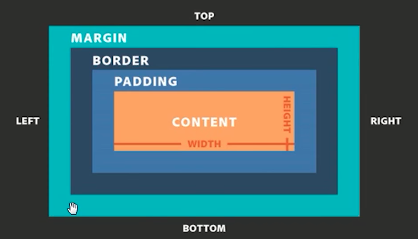
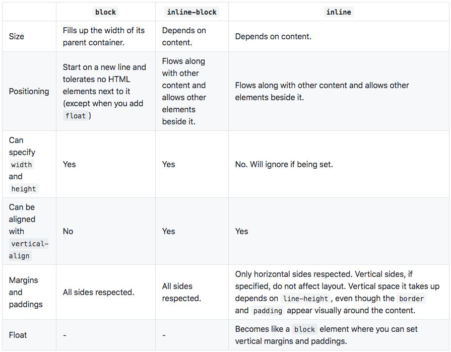

# CSS

## New features in CSS 3?

* Box Shadows
* CSS3 Selectors:
  * Although CSS selectors were too present in the previous versions, but here they are more updated and improved. Using these selectors, choosing DOM elements on the basis of there attributes is extremely easy. You don\`t really need to specify classes and IDs for each and every element. Instead, you can use these field elements to perform styling functions.
* Text Shadow
* Rounded Corners
* Border Images
* Opacity Levels
* Transform
* Font Additions:
  * Adding fonts is super easy in CSS 3, all you need to do is just upload the file to your server, link to the CSS file and add fonts as per your choice.

## What is CSS selector specificity and how does it work?

The browser determines what styles to show on an element depending on the specificity of CSS rules. We assume that the browser has already determined the rules that match a particular element. Among the matching rules, the specificity, four comma-separate values, `a, b, c, d` are calculated for each rule based on the following:

1. `a` is whether inline styles are being used. If the property declaration is an inline style on the element, `a` is 1, else 0.
2. `b` is the number of ID selectors.
3. `c` is the number of classes, attributes and pseudo-classes selectors.
4. `d` is the number of tags and pseudo-elements selectors.

The resulting specificity is not a score, but a matrix of values that can be compared column by column. When comparing selectors to determine which has the highest specificity, look from left to right, and compare the highest value in each column. So a value in column `b` will override values in columns `c` and `d`, no matter what they might be. As such, specificity of `0,1,0,0` would be greater than one of `0,0,10,10`.

In the cases of equal specificity: the latest rule is the one that counts. If you have written the same rule into your stylesheet \(regardless of internal or external\) twice, then the lower rule in your style sheet is closer to the element to be styled, it is deemed to be more specific and therefore will be applied.

I would write CSS rules with low specificity so that they can be easily overridden if necessary. When writing CSS UI component library code, it is important that they have low specificities so that users of the library can override them without using too complicated CSS rules just for the sake of increasing specificity or resorting to `!important`.

**References**

* [https://www.smashingmagazine.com/2007/07/css-specificity-things-you-should-know/](https://www.smashingmagazine.com/2007/07/css-specificity-things-you-should-know/)
* [https://www.sitepoint.com/web-foundations/specificity/](https://www.sitepoint.com/web-foundations/specificity/)

[\[↑\] Back to top](https://github.com/ChangtongZhou/front-end-interview-handbook/blob/master/questions/css-questions.md#css-questions)

## What's the difference between "resetting" and "normalizing" CSS? Which would you choose, and why?

* **Resetting** - Resetting is meant to strip all default browser styling on elements. For e.g. `margin`s, `padding`s, `font-size`s of all elements are reset to be the same. You will have to redeclare styling for common typographic elements.
* **Normalizing** - Normalizing preserves useful default styles rather than "unstyling" everything. It also corrects bugs for common browser dependencies.

I would choose resetting when I have a very customized or unconventional site design such that I need to do a lot of my own styling and do not need any default styling to be preserved.

**References**

* [https://stackoverflow.com/questions/6887336/what-is-the-difference-between-normalize-css-and-reset-css](https://stackoverflow.com/questions/6887336/what-is-the-difference-between-normalize-css-and-reset-css)

[\[↑\] Back to top](https://github.com/ChangtongZhou/front-end-interview-handbook/blob/master/questions/css-questions.md#css-questions)

## [Flexbox](https://css-tricks.com/snippets/css/a-guide-to-flexbox/):

* Flexbox is a **one-dimensional** layout method for laying out items in rows or columns. Items flex to fill additional space and shrink to fit into smaller spaces. This article explains all the fundamentals.
* The Flexible Box Layout Module, makes it easier to design flexible responsive layout structure without using float or positioning.

References:

[https://developer.mozilla.org/en-US/docs/Learn/CSS/CSS\_layout/Flexbox](https://developer.mozilla.org/en-US/docs/Learn/CSS/CSS_layout/Flexbox)

## Describe `float`s and how they work.

Float is a CSS positioning property. Floated elements remain a part of the flow of the page, and will affect the positioning of other elements \(e.g. text will flow around floated elements\), unlike `position: absolute` elements, which are removed from the flow of the page.

The CSS `clear` property can be used to be positioned below `left`/`right`/`both` floated elements.

If a parent element contains nothing but floated elements, its height will be collapsed to nothing. It can be fixed by clearing the float after the floated elements in the container but before the close of the container.

The `.clearfix` hack uses a clever CSS pseudo selector \(`:after`\) to clear floats. Rather than setting the overflow on the parent, you apply an additional class `clearfix` to it. Then apply this CSS:

```text
.clearfix:after {
  content: ' ';
  visibility: hidden;
  display: block;
  height: 0;
  clear: both;
}
```

Alternatively, give `overflow: auto` or `overflow: hidden` property to the parent element which will establish a new block formatting context inside the children and it will expand to contain its children.

**References**

* [https://css-tricks.com/all-about-floats/](https://css-tricks.com/all-about-floats/)

[\[↑\] Back to top](https://github.com/ChangtongZhou/front-end-interview-handbook/blob/master/questions/css-questions.md#css-questions)

## Describe `z-index` and how stacking context is formed.

The `z-index` property in CSS controls the vertical stacking order of elements that overlap. `z-index` only affects elements that have a `position` value which is not `static`.

Without any `z-index` value, elements stack in the order that they appear in the DOM \(the lowest one down at the same hierarchy level appears on top\). Elements with non-static positioning \(and their children\) will always appear on top of elements with default static positioning, regardless of HTML hierarchy.

A stacking context is an element that contains a set of layers. Within a local stacking context, the `z-index` values of its children are set relative to that element rather than to the document root. Layers outside of that context — i.e. sibling elements of a local stacking context — can't sit between layers within it. If an element B sits on top of element A, a child element of element A, element C, can never be higher than element B even if element C has a higher `z-index` than element B.

Each stacking context is self-contained - after the element's contents are stacked, the whole element is considered in the stacking order of the parent stacking context. A handful of CSS properties trigger a new stacking context, such as `opacity` less than 1, `filter` that is not `none`, and `transform` that is not`none`.

**References**

* [https://css-tricks.com/almanac/properties/z/z-index/](https://css-tricks.com/almanac/properties/z/z-index/)
* [https://philipwalton.com/articles/what-no-one-told-you-about-z-index/](https://philipwalton.com/articles/what-no-one-told-you-about-z-index/)
* [https://developer.mozilla.org/en-US/docs/Web/CSS/CSS\_Positioning/Understanding\_z\_index/The\_stacking\_context](https://developer.mozilla.org/en-US/docs/Web/CSS/CSS_Positioning/Understanding_z_index/The_stacking_context)

[\[↑\] Back to top](https://github.com/ChangtongZhou/front-end-interview-handbook/blob/master/questions/css-questions.md#css-questions)

## Describe Block Formatting Context \(BFC\) and how it works.

A Block Formatting Context \(BFC\) is part of the visual CSS rendering of a web page in which block boxes are laid out. Floats, absolutely positioned elements, `inline-blocks`, `table-cells`, `table-caption`s, and elements with `overflow`other than `visible` \(except when that value has been propagated to the viewport\) establish new block formatting contexts.

A BFC is an HTML box that satisfies at least one of the following conditions:

* The value of `float` is not `none`.
* The value of `position` is neither `static` nor `relative`.
* The value of `display` is `table-cell`, `table-caption`, `inline-block`, `flex`, or `inline-flex`.
* The value of `overflow` is not `visible`.

In a BFC, each box's left outer edge touches the left edge of the containing block \(for right-to-left formatting, right edges touch\).

Vertical margins between adjacent block-level boxes in a BFC collapse. Read more on [collapsing margins](https://www.sitepoint.com/web-foundations/collapsing-margins/).

**References**

* [https://developer.mozilla.org/en-US/docs/Web/Guide/CSS/Block\_formatting\_context](https://developer.mozilla.org/en-US/docs/Web/Guide/CSS/Block_formatting_context)
* [https://www.sitepoint.com/understanding-block-formatting-contexts-in-css/](https://www.sitepoint.com/understanding-block-formatting-contexts-in-css/)

[\[↑\] Back to top](https://github.com/ChangtongZhou/front-end-interview-handbook/blob/master/questions/css-questions.md#css-questions)

## CSS Box Model:

All HTML elements can be considered as boxes. In CSS, the term "box model" is used when talking about design and layout.

The CSS box model is essentially a box that wraps around every HTML element. It consists of: margins, borders, padding, and the actual content. The image below illustrates the box model:



## What are the various clearing techniques and which is appropriate for what context?

* Empty `div` method - `<div style="clear:both;"></div>`.
* Clearfix method - Refer to the `.clearfix` class above.
* `overflow: auto` or `overflow: hidden` method - Parent will establish a new block formatting context and expand to contains its floated children.

In large projects, I would write a utility `.clearfix` class and use them in places where I need it. `overflow: hidden` might clip children if the children is taller than the parent and is not very ideal.

[\[↑\] Back to top](https://github.com/ChangtongZhou/front-end-interview-handbook/blob/master/questions/css-questions.md#css-questions)

## Explain CSS sprites, and how you would implement them on a page or site.

CSS sprites combine multiple images into one single larger image. It is a commonly-used technique for icons \(Gmail uses it\). How to implement it:

1. Use a sprite generator that packs multiple images into one and generate the appropriate CSS for it.
2. Each image would have a corresponding CSS class with `background-image`, `background-position` and `background-size` properties defined.
3. To use that image, add the corresponding class to your element.

**Advantages:**

* Reduce the number of HTTP requests for multiple images \(only one single request is required per spritesheet\). But with HTTP2, loading multiple images is no longer much of an issue.
* Advance downloading of assets that won't be downloaded until needed, such as images that only appear upon `:hover` pseudo-states. Blinking wouldn't be seen.

**References**

* [https://css-tricks.com/css-sprites/](https://css-tricks.com/css-sprites/)

[\[↑\] Back to top](https://github.com/ChangtongZhou/front-end-interview-handbook/blob/master/questions/css-questions.md#css-questions)

## CSS Selectors vs. Properties:

* Selectors:
  * In CSS, selectors are patterns used to select the element\(s\) you want to style.
  * e.g. div, p, a, input
* [Properties](http://web.simmons.edu/~grabiner/comm244/weekthree/css-basic-properties.html):
  * Text, List, Border, Font properties

## How would you approach fixing browser-specific styling issues?

* After identifying the issue and the offending browser, use a separate style sheet that only loads when that specific browser is being used. This technique requires server-side rendering though.
* Use libraries like Bootstrap that already handles these styling issues for you.
* Use `autoprefixer` to automatically add vendor prefixes to your code.
* Use Reset CSS or Normalize.css.

[\[↑\] Back to top](https://github.com/ChangtongZhou/front-end-interview-handbook/blob/master/questions/css-questions.md#css-questions)

## How do you serve your pages for feature-constrained browsers? What techniques/processes do you use?

* Graceful degradation - The practice of building an application for modern browsers while ensuring it remains functional in older browsers.
* Progressive enhancement - The practice of building an application for a base level of user experience, but adding functional enhancements when a browser supports it.
* Use [caniuse.com](https://caniuse.com/) to check for feature support.
* Autoprefixer for automatic vendor prefix insertion.
* Feature detection using [Modernizr](https://modernizr.com/).
* Use CSS Feature queries [@support](https://developer.mozilla.org/en-US/docs/Web/CSS/@supports)

[\[↑\] Back to top](https://github.com/ChangtongZhou/front-end-interview-handbook/blob/master/questions/css-questions.md#css-questions)

## What are the different ways to visually hide content \(and make it available only for screen readers\)?

These techniques are related to accessibility \(a11y\).

* `visibility: hidden`. However, the element is still in the flow of the page, and still takes up space.
* `width: 0; height: 0`. Make the element not take up any space on the screen at all, resulting in not showing it.
* `position: absolute; left: -99999px`. Position it outside of the screen.
* `text-indent: -9999px`. This only works on text within the `block` elements.
* Metadata. For example by using Schema.org, RDF, and JSON-LD.
* WAI-ARIA. A W3C technical specification that specifies how to increase the accessibility of web pages.

Even if WAI-ARIA is the ideal solution, I would go with the `absolute` positioning approach, as it has the least caveats, works for most elements and it's an easy technique.

**References**

* [https://www.w3.org/TR/wai-aria-1.1/](https://www.w3.org/TR/wai-aria-1.1/)
* [https://developer.mozilla.org/en-US/docs/Web/Accessibility/ARIA](https://developer.mozilla.org/en-US/docs/Web/Accessibility/ARIA)
* [http://a11yproject.com/](http://a11yproject.com/)

[\[↑\] Back to top](https://github.com/ChangtongZhou/front-end-interview-handbook/blob/master/questions/css-questions.md#css-questions)

## Have you ever used a grid system, and if so, what do you prefer?

I like the `float`-based grid system because it still has the most browser support among the alternative existing systems \(flex, grid\). It has been used in Bootstrap for years and has been proven to work.

[\[↑\] Back to top](https://github.com/ChangtongZhou/front-end-interview-handbook/blob/master/questions/css-questions.md#css-questions)

## Grid System:

### What is a grid system?

It is a structure that allows for content to be stacked both vertically and horizontally in a consistent and easily manageable way.

### Benefits of a grid system?

* They increase productivity: provide simple and predictable layout for HTML desgin.
* They are versatile: the layouts can be adaptable in different combinations of rows and columns. They support nested grids for complex use cases.
* They are ideal for responsive layouts.

### Primary Compoments of grid system:
* rows: accommodate the columns
* columns: make up the final structure and contain the actual content.
* some grid systems will additionally include containers, which serve as wrappers for the layout

### Resetting the box model on grid system:
By default, the browser doesnt include the padding and border within the declared width and height of an element, this is not good for responsiveness. Hence, we can set the `box-sizing` property to `border-box` for both rows and columns

e.g.
```CSS
.row, .column {
 box-sizing: border-box;
}
```
Now we can leverage percentages for the widths of the columns. This allows the columns to scalre upwards and downwards within different viewports while maintaining the structure.

### Creating Gutters:
* Gutters help to create separation between columns for greater legibility and aesthetics.
* 2 ways:
  1. defining paddings within each column 
  2. Using a percentage-based left margin for each column (recommended, because it is more responsive to different viewport)
    e.g.
    ```css
    .column + .column {
     margin-left: 1.6%;
    }
    ```
    Above will create a left margin (1.6%) for every column except the first one.

## Have you used or implemented media queries or mobile-specific layouts/CSS?

Yes. 
e.g.1
```css
@media only screen and (max-width: 550px) {
    .column-1, 
    .column-2, 
    .column-3, 
    .column-4, 
    .column-5, 
    .column-6, 
    .column-7, 
    .column-8, 
    .column-9, 
    .column-10, 
    .column-11, 
    .column-12 {
        width: auto;
        float: none;
    }

    .column + .column {
        margin-left: 0;
    }
}

```
Above tells the grid to allow every column to take up the full width of its container for devices with a smaller than 550px wide. Since gutters are no longer needded here, we remote those too

e.g.2
Another example would be transforming a stacked pill navigation into a fixed-bottom tab navigation beyond a certain breakpoint.


[\[↑\] Back to top](https://github.com/ChangtongZhou/front-end-interview-handbook/blob/master/questions/css-questions.md#css-questions)

## Are you familiar with styling SVG?

Yes, there are several ways to color shapes \(including specifying attributes on the object\) using inline CSS, an embedded CSS section, or an external CSS file. Most SVG you'll find around the web use inline CSS, but there are advantages and disadvantages associated with each type.

Basic coloring can be done by setting two attributes on the node: `fill` and `stroke`. `fill` sets the color inside the object and `stroke` sets the color of the line drawn around the object. You can use the same CSS color naming schemes that you use in HTML, whether that's color names \(that is `red`\), RGB values \(that is `rgb(255,0,0)`\), Hex values, RGBA values, etc.

```text
<rect x="10" y="10" width="100" height="100" stroke="blue" 
  fill="purple" fill-opacity="0.5" stroke-opacity="0.8"/>
```

**References**

* [https://developer.mozilla.org/en-US/docs/Web/SVG/Tutorial/Fills\_and\_Strokes](https://developer.mozilla.org/en-US/docs/Web/SVG/Tutorial/Fills_and_Strokes)

[\[↑\] Back to top](https://github.com/ChangtongZhou/front-end-interview-handbook/blob/master/questions/css-questions.md#css-questions)

## Can you give an example of an @media property other than screen?

Yes, there are four types of @media properties \(including _screen_\):

* `all` - for all media type devices
* `print` - for printers
* `speech` - for screenreaders that "reads" the page out loud
* `screen` - for computer screens, tablets, smart-phones etc.

Here is an example of `print` media type's usage:

```text
@media print {
  body {
    color: black;
  }
}
```

**References**

* [https://developer.mozilla.org/en-US/docs/Web/CSS/@media\#Syntax](https://developer.mozilla.org/en-US/docs/Web/CSS/@media#Syntax)

[\[↑\] Back to top](https://github.com/ChangtongZhou/front-end-interview-handbook/blob/master/questions/css-questions.md#css-questions)

## What are some of the "gotchas" for writing efficient CSS?

Firstly, understand that browsers match selectors from rightmost \(key selector\) to left. Browsers filter out elements in the DOM according to the key selector and traverse up its parent elements to determine matches. The shorter the length of the selector chain, the faster the browser can determine if that element matches the selector. Hence avoid key selectors that are tag and universal selectors. They match a large number of elements and browsers will have to do more work in determining if the parents do match.

[BEM \(Block Element Modifier\)](https://bem.info/) methodology recommends that everything has a single class, and, where you need hierarchy, that gets baked into the name of the class as well, this naturally makes the selector efficient and easy to override.

Be aware of which CSS properties trigger reflow, repaint, and compositing. Avoid writing styles that change the layout \(trigger reflow\) where possible.

**References**

* [https://developers.google.com/web/fundamentals/performance/rendering/](https://developers.google.com/web/fundamentals/performance/rendering/)
* [https://csstriggers.com/](https://csstriggers.com/)

[\[↑\] Back to top](https://github.com/ChangtongZhou/front-end-interview-handbook/blob/master/questions/css-questions.md#css-questions)

## What are the advantages/disadvantages of using CSS preprocessors?

**Advantages:**

* CSS is made more maintainable.
* Easy to write nested selectors.
* Variables for consistent theming. Can share theme files across different projects.
* Mixins to generate repeated CSS.
* Splitting your code into multiple files. CSS files can be split up too but doing so will require an HTTP request to download each CSS file.

**Disadvantages:**

* Requires tools for preprocessing. Re-compilation time can be slow.

[\[↑\] Back to top](https://github.com/ChangtongZhou/front-end-interview-handbook/blob/master/questions/css-questions.md#css-questions)

### Less

* A CSS preprocessor that generates CSS
* A backwards-compatible language extension for CSS
* Pros:
   * It saves time from typing and makes things more portable/templateable and adds functionality to CSS previously unavailable.
   * It allows you to be more programmatic in your writing.
   * It allows you to use variables to avoid redundant code, and allow you change the value of a variable.
* Good features:
    * Variables
    * Mixins: treat classes and ids as function which can be invoked inside of other classes and ids. You can include full css description by just typing the name of the class/id and putting(); after it.
    * Functions
    * Importing: breaks your CSS into smaller files and import them as needed
    * Nested Directives: allows @media to be nested inside of a class just like selectors can. It saves having to write so many redundant grouping of classes for different media queries

#### Describe what you like and dislike about the CSS preprocessors you have used.

**Likes:**

* Mostly the advantages mentioned above.
* Less is written in JavaScript, which plays well with Node.

**Dislikes:**

* I use Sass via `node-sass`, which is a binding for LibSass written in C++. I have to frequently recompile it when switching between node versions.
* In Less, variable names are prefixed with `@`, which can be confused with native CSS keywords like `@media`, `@import`and `@font-face` rule.

[\[↑\] Back to top](https://github.com/ChangtongZhou/front-end-interview-handbook/blob/master/questions/css-questions.md#css-questions)

## How would you implement a web design comp that uses non-standard fonts?

Use `@font-face` and define `font-family` for different `font-weight`s.

[\[↑\] Back to top](https://github.com/ChangtongZhou/front-end-interview-handbook/blob/master/questions/css-questions.md#css-questions)

## Explain how a browser determines what elements match a CSS selector.

This part is related to the above about writing efficient CSS. Browsers match selectors from rightmost \(key selector\) to left. Browsers filter out elements in the DOM according to the key selector and traverse up its parent elements to determine matches. The shorter the length of the selector chain, the faster the browser can determine if that element matches the selector.

For example with this selector `p span`, browsers firstly find all the `<span>` elements and traverse up its parent all the way up to the root to find the `<p>` element. For a particular `<span>`, as soon as it finds a `<p>`, it knows that the `<span>`matches and can stop its matching.

**References**

* [https://stackoverflow.com/questions/5797014/why-do-browsers-match-css-selectors-from-right-to-left](https://stackoverflow.com/questions/5797014/why-do-browsers-match-css-selectors-from-right-to-left)

[\[↑\] Back to top](https://github.com/ChangtongZhou/front-end-interview-handbook/blob/master/questions/css-questions.md#css-questions)

## Describe pseudo-elements and discuss what they are used for.

A CSS pseudo-element is a keyword added to a selector that lets you style a specific part of the selected element\(s\). They can be used for **decoration** \(`:first-line`, `:first-letter`\) or **adding elements to the markup** \(combined with `content: ...`\) without having to modify the markup \(`:before`, `:after`\).

* `:first-line` and `:first-letter` can be used to decorate text.
* Used in the `.clearfix` hack as shown above to add a zero-space element with `clear: both`.
* Triangular arrows in tooltips use `:before` and `:after`. Encourages separation of concerns because the triangle is considered part of styling and not really the DOM. It's not really possible to draw a triangle with just CSS styles without using an additional HTML element.

**References**

* [https://css-tricks.com/almanac/selectors/a/after-and-before/](https://css-tricks.com/almanac/selectors/a/after-and-before/)

[\[↑\] Back to top](https://github.com/ChangtongZhou/front-end-interview-handbook/blob/master/questions/css-questions.md#css-questions)

## Explain your understanding of the box model and how you would tell the browser in CSS to render your layout in different box models.

The CSS box model describes the rectangular boxes that are generated for elements in the document tree and laid out according to the visual formatting model. Each box has a content area \(e.g. text, an image, etc.\) and optional surrounding `padding`, `border`, and `margin` areas.

The CSS box model is responsible for calculating:

* How much space a block element takes up.
* Whether or not borders and/or margins overlap, or collapse.
* A box's dimensions.

The box model has the following rules:

* The dimensions of a block element are calculated by `width`, `height`, `padding`, `border`s, and `margin`s.
* If no `height` is specified, a block element will be as high as the content it contains, plus `padding` \(unless there are floats, for which see below\).
* If no `width` is specified, a non-floated block element will expand to fit the width of its parent minus `padding`.
* The `height` of an element is calculated by the content's `height`.
* The `width` of an element is calculated by the content's `width`.
* By default, `padding`s and `border`s are not part of the `width` and `height` of an element.

**References**

* [https://www.smashingmagazine.com/2010/06/the-principles-of-cross-browser-css-coding/\#understand-the-css-box-model](https://www.smashingmagazine.com/2010/06/the-principles-of-cross-browser-css-coding/#understand-the-css-box-model)

[\[↑\] Back to top](https://github.com/ChangtongZhou/front-end-interview-handbook/blob/master/questions/css-questions.md#css-questions)

## What does `* { box-sizing: border-box; }` do? What are its advantages?

* By default, elements have `box-sizing: content-box` applied, and only the content size is being accounted for.
* `box-sizing: border-box` changes how the `width` and `height` of elements are being calculated, `border` and `padding` are also being included in the calculation.
* The `height` of an element is now calculated by the content's `height` + vertical `padding` + vertical `border` width.
* The `width` of an element is now calculated by the content's `width` + horizontal `padding` + horizontal `border`width.
* Taking into account `padding`s and `border`s as part of our box model resonates better with how designers actually imagine content in grids.

**References**

* [https://www.paulirish.com/2012/box-sizing-border-box-ftw/](https://www.paulirish.com/2012/box-sizing-border-box-ftw/)

[\[↑\] Back to top](https://github.com/ChangtongZhou/front-end-interview-handbook/blob/master/questions/css-questions.md#css-questions)

## What is the CSS `display` property and can you give a few examples of its use?

* `none`, `block`, `inline`, `inline-block`, `table`, `table-row`, `table-cell`, `list-item`.

TODO

[\[↑\] Back to top](https://github.com/ChangtongZhou/front-end-interview-handbook/blob/master/questions/css-questions.md#css-questions)

#### What's the difference between `inline` and `inline-block`?(https://medium.com/@DaphneWatson/css-display-properties-block-inline-and-inline-block-how-to-tell-the-difference-7d3a1e6e3051)

## I shall throw in a comparison with `block` for good measure.



[\[↑\] Back to top](https://github.com/ChangtongZhou/front-end-interview-handbook/blob/master/questions/css-questions.md#css-questions)

### Block:
* Always starts on a new line, and fills up the horizontal space left and right on the web page.
* Can add margins and padding on all four sides of any block element
* e.g. `<div>` and `p` tags

### Inline Element:
* Don't start on a new line, appear on the same line as the content and tags beside them.
* Can only add margins and padding to the left and right on an inline element, cannot add height to the top/bottom padding
  or marging
* e.g. `<span>`, `<strong>`, and `` tags.

### Inline Block:
* Similar to inline elements, but they can have padding and margins added on all four sides
* You have to declare display: `inline-block` in your CSS code.
* Usage: create navigation links horizontally

Note: We can center inline-block elements using `text-align: center`

## What's the difference between a `relative`, `fixed`, `absolute` and `static`ally positioned element?

A positioned element is an element whose computed `position` property is either `relative`, `absolute`, `fixed` or `sticky`.

* `static` - The default position; the element will flow into the page as it normally would. The `top`, `right`, `bottom`, `left` and `z-index` properties do not apply.
* `relative` - The element's position is adjusted relative to itself, without changing layout \(and thus leaving a gap for the element where it would have been had it not been positioned\).
* `absolute` - The element is removed from the flow of the page and positioned at a specified position relative to its closest positioned ancestor if any, or otherwise relative to the initial containing block. Absolutely positioned boxes can have margins, and they do not collapse with any other margins. These elements do not affect the position of other elements.
* `fixed` - The element is removed from the flow of the page and positioned at a specified position relative to the viewport and doesn't move when scrolled.
* `sticky` - Sticky positioning is a hybrid of relative and fixed positioning. The element is treated as `relative`positioned until it crosses a specified threshold, at which point it is treated as `fixed` positioned.

**References**

* [https://developer.mozilla.org/en/docs/Web/CSS/position](https://developer.mozilla.org/en/docs/Web/CSS/position)

[\[↑\] Back to top](https://github.com/ChangtongZhou/front-end-interview-handbook/blob/master/questions/css-questions.md#css-questions)

## What existing CSS frameworks have you used locally, or in production? How would you change/improve them?

* **Bootstrap** - Slow release cycle. Bootstrap 4 has been in alpha for almost 2 years. Add a spinner button component, as it is widely used.
* **Semantic UI** - Source code structure makes theme customization extremely hard to understand. Its unconventional theming system is a pain to customize. Hardcoded config path within the vendor library. Not well-designed for overriding variables unlike in Bootstrap.
* **Bulma** - A lot of non-semantic and superfluous classes and markup required. Not backward compatible. Upgrading versions breaks the app in subtle manners.

[\[↑\] Back to top](https://github.com/ChangtongZhou/front-end-interview-handbook/blob/master/questions/css-questions.md#css-questions)

## Have you played around with the new CSS Flexbox or Grid specs?

Yes. Flexbox is mainly meant for 1-dimensional layouts while Grid is meant for 2-dimensional layouts.

Flexbox solves many common problems in CSS, such as vertical centering of elements within a container, sticky footer, etc. Bootstrap and Bulma are based on Flexbox, and it is probably the recommended way to create layouts these days. Have tried Flexbox before but ran into some browser incompatibility issues \(Safari\) in using `flex-grow`, and I had to rewrite my code using `inline-blocks` and math to calculate the widths in percentages, it wasn't a nice experience.

Grid is by far the most intuitive approach for creating grid-based layouts \(it better be!\) but browser support is not wide at the moment.

**References**

* [https://philipwalton.github.io/solved-by-flexbox/](https://philipwalton.github.io/solved-by-flexbox/)

[\[↑\] Back to top](https://github.com/ChangtongZhou/front-end-interview-handbook/blob/master/questions/css-questions.md#css-questions)

## Can you explain the difference between coding a website to be responsive versus using a mobile-first strategy?

Note that these two 2 approaches are not exclusive.

Making a website responsive means the some elements will respond by adapting its size or other functionality according to the device's screen size, typically the viewport width, through CSS media queries, for example, making the font size smaller on smaller devices.

```text
@media (min-width: 601px) {
  .my-class {
    font-size: 24px;
  }
}
@media (max-width: 600px) {
  .my-class {
    font-size: 12px;
  }
}
```

A mobile-first strategy is also responsive, however it agrees we should default and define all the styles for mobile devices, and only add specific responsive rules to other devices later. Following the previous example:

```text
.my-class {
  font-size: 12px;
}

@media (min-width: 600px) {
  .my-class {
    font-size: 24px;
  }
}
```

A mobile-first strategy has 2 main advantages:

* It's more performant on mobile devices, since all the rules applied for them don't have to be validated against any media queries.
* It forces to write cleaner code in respect to responsive CSS rules.

[\[↑\] Back to top](https://github.com/ChangtongZhou/front-end-interview-handbook/blob/master/questions/css-questions.md#css-questions)

## How is responsive design different from adaptive design?

Both responsive and adaptive design attempt to optimize the user experience across different devices, adjusting for different viewport sizes, resolutions, usage contexts, control mechanisms, and so on.

Responsive design works on the principle of flexibility - a single fluid website that can look good on any device. Responsive websites use media queries, flexible grids, and responsive images to create a user experience that flexes and changes based on a multitude of factors. Like a single ball growing or shrinking to fit through several different hoops.

Adaptive design is more like the modern definition of progressive enhancement. Instead of one flexible design, adaptive design detects the device and other features and then provides the appropriate feature and layout based on a predefined set of viewport sizes and other characteristics. The site detects the type of device used and delivers the pre-set layout for that device. Instead of a single ball going through several different-sized hoops, you'd have several different balls to use depending on the hoop size.

**References**

* [https://developer.mozilla.org/en-US/docs/Archive/Apps/Design/UI\_layout\_basics/Responsive\_design\_versus\_adaptive\_design](https://developer.mozilla.org/en-US/docs/Archive/Apps/Design/UI_layout_basics/Responsive_design_versus_adaptive_design)
* [http://mediumwell.com/responsive-adaptive-mobile/](http://mediumwell.com/responsive-adaptive-mobile/)
* [https://css-tricks.com/the-difference-between-responsive-and-adaptive-design/](https://css-tricks.com/the-difference-between-responsive-and-adaptive-design/)

[\[↑\] Back to top](https://github.com/ChangtongZhou/front-end-interview-handbook/blob/master/questions/css-questions.md#css-questions)

## Have you ever worked with retina graphics? If so, when and what techniques did you use?

_Retina_ is just a marketing term to refer to high resolution screens with a pixel ratio bigger than 1. The key thing to know is that using a pixel ratio means these displays are emulating a lower resolution screen in order to show elements with the same size. Nowadays we consider all mobile devices _retina_ defacto displays.

Browsers by default render DOM elements according to the device resolution, except for images.

In order to have crisp, good-looking graphics that make the best of retina displays we need to use high resolution images whenever possible. However using always the highest resolution images will have an impact on performance as more bytes will need to be sent over the wire.

To overcome this problem, we can use responsive images, as specified in HTML5. It requires making available different resolution files of the same image to the browser and let it decide which image is best, using the html attribute `srcset`and optionally `sizes`, for instance:

```text
<div responsive-background-image>  
  
</div>
```

It is important to note that browsers which don't support HTML5's `srcset` \(i.e. IE11\) will ignore it and use `src` instead. If we really need to support IE11 and we want to provide this feature for performance reasons, we can use a JavaScript polyfill, e.g. Picturefill \(link in the references\).

For icons, I would also opt to use SVGs and icon fonts where possible, as they render very crisply regardless of resolution.

**References**

* [https://css-tricks.com/responsive-images-youre-just-changing-resolutions-use-srcset/](https://css-tricks.com/responsive-images-youre-just-changing-resolutions-use-srcset/)
* [http://scottjehl.github.io/picturefill/](http://scottjehl.github.io/picturefill/)
* [https://aclaes.com/responsive-background-images-with-srcset-and-sizes/](https://aclaes.com/responsive-background-images-with-srcset-and-sizes/)

[\[↑\] Back to top](https://github.com/ChangtongZhou/front-end-interview-handbook/blob/master/questions/css-questions.md#css-questions)

## Is there any reason you'd want to use `translate()` instead of `absolute` positioning, or vice-versa? And why?

`translate()` is a value of CSS `transform`. Changing `transform` or `opacity` does not trigger browser reflow or repaint but does trigger compositions; whereas changing the absolute positioning triggers `reflow`. `transform` causes the browser to create a GPU layer for the element but changing absolute positioning properties uses the CPU. Hence `translate()` is more efficient and will result in shorter paint times for smoother animations.

When using `translate()`, the element still occupies its original space \(sort of like `position: relative`\), unlike in changing the absolute positioning.

**References**

* [https://www.paulirish.com/2012/why-moving-elements-with-translate-is-better-than-posabs-topleft/](https://www.paulirish.com/2012/why-moving-elements-with-translate-is-better-than-posabs-topleft/)

## dfssf


## What is the order of greatest to least specificity?

* classes
* ids
* inline style attributes
* elements

Ans: the greatest to least order is:

* inline style attributes
* ids
* classes
* elements

## What's the difference between:

```text
.shopping-list.list-item {
    // ...
}

.shopping-list .list-item {
    // ...
}

.shoppinga-list > .list-item {
    // ...
}
```

Ans:

```text
.shopping-list.list-item {
    // ...
}
```

* means: an element with both class `shopping-list` and `list-item`
* e.g.

  ```text
  <div class="shopping-list list-item"> (element) </div>
  ```

```text
.shopping-list .list-item {
    // ...
}
```

* means: an element with class `list-item` for which its ancestor has class `shopping-list`
* e.g.1

  ```text
  <div class="shopping-list">
      <div class="list-item">(element)</div>
  </div> 
  ```

* e.g.2

  ```text
  <div class="shopping-list">
      <div class="other-stuff">
          <div class="list-item">(element)</div>
      </div>
  </div> 
  ```

```text
.shoppinga-list > .list-item {
    // ...
}
```

* This is a child combinator, it represents a strict child/parent relationship where `list-item` is a direct child element of its parent element `shopping-list`
* e.g.

  ```text
  <div class="shopping-list">
      <div class="list-item">(element)</div>
  </div>
  ```

## What's the difference between `display: none` and `visibility: hidden`, and when would choose one over the other?

Ans:

* `display: none` makes element not showing in the page and it doesn't preserve any space.
* `visibility: hidden` hides an element, but still reserver the same space as before.
* When you want to hide an element and doesn't want it affect the page layout, then use `display: none`, otherwise, use `visibility: hidden`.

## What are other ways to visually hide content?

Ans:

1. Set opacity of an element to 0

* e.g.

```text
.hide {
  opacity: 0;
}
```

2. Set position

* e.g.

```text
.hide {
  position: absolute;
  top: -9999px;
  left: -9999px;
}
```

3. Use clip-path

* e.g.

```text
.hide {clip-path: polygon(0px 0px,0px 0px,0px 0px,0px 0px);}
```

## Have a look at the following jsfiddle: [http://jsfiddle.net/mipark2csco/o9v5rdpa/2/](http://jsfiddle.net/mipark2csco/o9v5rdpa/2/)

* fork this guy \(hit 'Fork'\)
* make the following changes, and save a new jsfiddle for each task \(hit 'Update'\), and paste your saved links back here:
  * horizontally center the box: [http://jsfiddle.net/760kc1jh/2/](http://jsfiddle.net/760kc1jh/2/)
  * right-align the box: [http://jsfiddle.net/760kc1jh/5/](http://jsfiddle.net/760kc1jh/5/)
  * align the box in the bottom-right corner: [http://jsfiddle.net/760kc1jh/8/](http://jsfiddle.net/760kc1jh/8/)
  * horizontally and vertically center the box: [http://jsfiddle.net/760kc1jh/15/](http://jsfiddle.net/760kc1jh/15/)

## Have a look at the following jsfiddle: [https://jsfiddle.net/mipark2csco/v4k5rjag/](https://jsfiddle.net/mipark2csco/v4k5rjag/)

* fork this guy \(hit 'Fork'\)
* make the following changes, and save a new jsfiddle for each task \(hit 'Update'\), and paste your saved links back here:
  * vertically center the three boxes: [https://jsfiddle.net/pLwxubod/27/](https://jsfiddle.net/pLwxubod/27/)
  * horizontally center the three boxes: [https://jsfiddle.net/pLwxubod/1/](https://jsfiddle.net/pLwxubod/1/)
  * space the three boxes evenly horizontally, and center them vertically: [https://jsfiddle.net/pLwxubod/20/](https://jsfiddle.net/pLwxubod/20/)

[\[↑\] Back to top](https://github.com/ChangtongZhou/front-end-interview-handbook/blob/master/questions/css-questions.md#css-questions)

## Other Answers

* [https://neal.codes/blog/front-end-interview-css-questions](https://neal.codes/blog/front-end-interview-css-questions)
* [https://quizlet.com/28293152/front-end-interview-questions-css-flash-cards/](https://quizlet.com/28293152/front-end-interview-questions-css-flash-cards/)
* [http://peterdoes.it/2015/12/03/a-personal-exercise-front-end-job-interview-questions-and-my-answers-all/](http://peterdoes.it/2015/12/03/a-personal-exercise-front-end-job-interview-questions-and-my-answers-all/)

