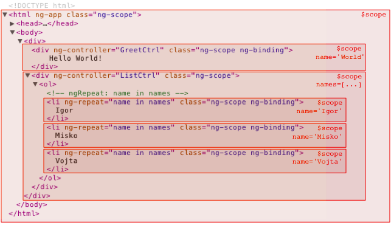

# JavaScript

## Describe your work flow when you create a web page?

* Start with visual design \(like photoshop mockup\)
* Start code up mockups with HTML and add CSS styling in ATOM/Sublime
* Use JavaScript needed, put JavaScript in the bottom of the page, so the page can load faster
* Make sure my images are optimized, so they are not too big to slow down the page
* Minify CSS/JS files, i.e. removing white spaces that we don't need, so the files can load much quicker
* When I finish coding, I will make sure my code is readable and follows W3 standards
* When I finish the project, I make sure my website is working well with all kinds of browsers and devices like it has to be working with firefox, chrome, Internet Explore all the same
* Make sure my website is responsive to be working on desktop, tablets, and mobile phones

## Differences between variables created using `let`, `var` or `const`?

* Variable declarations using `var` are scoped to the function in which they are created, i.e. treated as if they are at the top of the function \(or global scope, if declared outside of a function\) regardless of where the actual declaration occurs; this is called **hoisting**.
* `let` and `const` are block scoped, meaning they are only accessible within the nearest set of curly braces \(function, if-else block, or for-loop\).

```javascript
function foo() {
  // All variables are accessible within functions.
  var bar = 'bar';
  let baz = 'baz';
  const qux = 'qux';
  console.log(bar); // bar
  console.log(baz); // baz
  console.log(qux); // qux
}
console.log(bar); // ReferenceError: bar is not defined
console.log(baz); // ReferenceError: baz is not defined
console.log(qux); // ReferenceError: qux is not defined
```

* `var` allows variables to be hoisted, meaning they can be referenced in code before they are declared. `let` and `const` will not allow this, instead throwing an error.

```javascript
console.log(foo); // undefined
var foo = 'foo';
console.log(baz); // ReferenceError: can't access lexical declaration 'baz' before initialization
let baz = 'baz';
console.log(bar); // ReferenceError: can't access lexical declaration 'bar' before initialization
const bar = 'bar';
```

* Redeclaring a variable with `var` will not throw an error, but '`let`' and '`const`' will.

```javascript
var foo = 'foo';
var foo = 'bar';
console.log(foo); // "bar"

let baz = 'baz';
let baz = 'qux'; // Uncaught SyntaxError: Identifier 'baz' has already been declared
```

* `let` and `const` differ in that `let` allows reassigning the variable's value while `const` does not.

```javascript
// This is fine.
let foo = 'foo';
foo = 'bar';

// This causes an exception.
const baz = 'baz';
baz = 'qux';
```

## Hoisting:

The behavior of variable declarations in your code. Variables declared or initialized with the var keyword will have their declaration "moved" up to the tope of the current scope.

* Note:
  * Only the declaration is hoisted, the assignment will stay where it is.
  * Declaration is not actually moved:
    * JS engine parses the declarations during compilation and becomes aware of declarations and their scopes. It is just easier to understand this behavior by visualizing the declarations as being hoisted to the top of their scope.
* e.g.

```javascript
// var declarations are hoisted.
console.log(foo); // undefined
var foo = 1;
console.log(foo); // 1

// let/const declarations are NOT hoisted.
console.log(bar); // ReferenceError: bar is not defined
let bar = 2;
console.log(bar); // 2
```

* Function declarations have the body hoisted while the function expressions \(written in the form of variable declarations\) only has the variable declaration hoisted.

```javascript
// Function Declaration
console.log(foo); // [Function: foo]
foo(); // 'FOOOOO'
function foo() {
  console.log('FOOOOO');
}
console.log(foo); // [Function: foo]

// Function Expression
console.log(bar); // undefined
bar(); // Uncaught TypeError: bar is not a function
var bar = function() {
  console.log('BARRRR');
};
console.log(bar); // [Function: bar]
```

## Arrow Function:

* Def: An arrow function expression has a shorter syntax and lexically binds its `this` value
* No `this`, `super`, `arguments`, and `new.target` bindings - The value of this, super, arguments, and new.target inside of the function is by the closest containing nonarrow function.
* Cannot be called with `new` - Arrow functions do not have a \[\[Construct\]\] method and therefore cannot be used as constructors. Arrow functions throw an error when used with new.
* No prototype - since you can’t use new on an arrow function, there’s no need for a prototype. The prototype property of an arrow function doesn’t exist.
* Can’t change `this` - The value of this inside of the function can’t be changed. It remains the same throughout the entire lifecycle of the function.
* No arguments object - Since arrow functions have no arguments binding, you must rely on named and rest parameters to access function arguments.
* No duplicate named parameters - arrow functions cannot have duplicate named parameters in strict or nonstrict mode, as opposed to nonarrow functions that cannot have duplicate named parameters only in strict mode.
* **Syntax**:

```javascript
let sum = (num1, num2) => num1 + num2;
// effectively equivalent to:
let sum = (num1, num2) => {
  return num1 + num2;
}
// effectively equivalent to:
let sum = function(num1, num2) {
    return num1 + num2;
};
```

* `This`:

```javascript
function run() {
  this.name = 'React';
  setTimeout(function() {
    console.log(this.name);
  }, 3000);
}
run(); // undefined

/*===================================*/
function run() {
  this.name = 'React';
  var that = this;
  setTimeout(function() {
    console.log(that.name);
  }, 3000);
}
run(); // React

/*===================================*/
function run() {
  this.name = 'React';
  setTimeout(() => {
    console.log(this.name);
  }, 3000);
}
run(); // React
```

## Know functions:

### [Functions](https://developer.mozilla.org/en-US/docs/Web/JavaScript/Reference/Functions):

A function is composed of a sequence of statements \(function body\). In JS, functions are first-class objects, because they can have properties and methods just like any other object. What distinguishes them from other objects is that functions can be called.

### Passing a function VS. Calling a function:

#### Passing a function:

Functions can be passed as a parameter into another function, usually is called callback functions.

#### Calling a function:

Pass values into a function, and the function will do some operations and return an output value

* `<Function>.call` is a method that executes the defined function, but with the "this" variable pointing to the first argument, and the rest of the arguments being arguments of the function that is being "called".

## Prototype chain:

Javascript object doesn't have a type or a class that it gets its methods from, it has a prototype, including the prototype object. This "chain" goes all the way back until it reaches an object that has no prototype, usually Object's prototype. Prototype's version of "Inheritance" involves adding another link to the end of this prototype chain.

* Check current object's prototype: 
* `console.log(Object.getPrototypeOf(obj_var));`
* `<Function>.call` is a method that executes the defined function, but with the "this" variable pointing to the first argument, and the rest of the arguments being arguments of the function that is being "called". 
* `Object.create(obj)` creates an object with a prototype of the passed in object 

## [Asynchronous design patterns: ](https://medium.com/@stevekonves/three-javascript-async-patterns-1d2e7094860a)

## Callback function:

[http://javascriptissexy.com/understand-javascript-callback-functions-and-use-them/](http://javascriptissexy.com/understand-javascript-callback-functions-and-use-them/)

### **Def**

A function that is passed to another function as a parameter, and the callback function is called \(or executed\) inside the other function

### How to create a function that accepts callback and calls that callback

You can just call it as a normal function:

```javascript
function myFunction(param1, callbackfunction) {
    // do processing here
    callbackfunciton();
}
```

The only extra thing is to mention context. If you want to be able to use the this keyword within your callback, you will have to assign it. This is frequently desirable behavior. For instance:

```javascript
function myFunction(param1, callbackfunction) {
    // do processing here
    callbackfunciton(param1);
}
```

In the callback, you can now access `param1` as `this`

### What are the ways to bus errors through callback

**Code Assignment:**

@13:57 DOM

## Event propagation, event model in the browser:

### Event propagation:

Def: Event propagation is a way to describe the “stack” of events that are fired in a web browser

* when an event occurs in an element inside another element, and both elements have registered a handle for that event. The event propagation mode determines in which order the elements receive the event 

### Event bubbling:

The event is first captured and handled by the innermost element and then propagated to outer elements.

### Event capturing/ trickling:

* The event is first captured by the outermost element and propagated to the inner elements. 

We can use the `addEventListener(type, listener, useCapture)`to register event handlers for in either bubbling \(default\) or capturing mode.

* Event Capturing model: pass the third argument as `true`
* Event Bubbling mode: pass the third argument as `false`

### How to prevent the browser from doing the default behavior?

Like you click the link, but you don't want the browser to go somewhere

You are submitting the form and you don't want the browser to submit it, in fact you just want to catch that event and do something like maybe put the alert box, but do not send the form itself

## Event Delegation:

* Add event listeners to a parent element instead of adding them to the descendant elements \(child elements\) 
* The listener fires whenever the event is triggered on the descendant elements because of event bubbling up the DOM 
* Benefits: 
  * Reduces memory footprint because only 1 handler is needed on the parent element, rather than attaching event handlers on each descendant 
  * No need to unbind the handler from elements that are removed and to bind the event for new elements 

## Explain “This” in JS:

* When “`new`” keyword is used for calling the function, “`this`”: a new object inside the function
* When “`apply`”, “`call`”, “`bind`” are used to call/create a function, “`this`”: the object that is passed in as the argument inside that function 
* When a function is called as a method, like `obj.method()`, “`this`”: the object of that function
* When a free function invocation happens, i.e. a function was invoked without any of the conditions present above, “`this`”: a global object 
  * In a browser, it is the “`window`” object. If in strict mode \(‘`use strict`’\), “`this`”: undefined
* When multiple of the above rules apply, the higher rule will set the “`this`” value 
* When the function is an ES2015 arrow function, ignores all the rules above, “`this`”: a value of its surrounding scope at the time it is created 

## `==` Vs. `===`:

### `==`:

* is the abstract equality operator 
* compares value 
* compares for equality after doing any necessary type conversions 
* **`===`:**
* is the strict equality operator.
* compares data type and value 
* doesn't do type conversion, so if two values are not the same type, will return `false` 

### Funcky things happen when using `==`:

```javascript
1 == '1'; // true
1 == [1]; // true
1 == true; // true
0 == ''; // true
0 == '0'; // true
0 == false; // true
```

**Never use** `==` **operator, except for convenience when comparing against** `null` **or** `undefined`**, where** `a == null` **will return** `true` **if a is** `null` **or** `undefined`**.**

```javascript
var a = null;
console.log( a == null); // true
console.log(a == undefined); // true
```

## Prototypal inheritance:

* A private property of an object holds a link/reference to another object 
* When a property of an object is not found, the JavaScript engine looks at the object’s prototype, and the prototype’s prototype and so on, until it finds the property defined on one of the prototypes or until it reaches the end of the prototype chain. It simulates classical inheritance, but it is really more like delegation. Because you are indicating an object to delegate behavior to if that behavior isn’t defined on the object in question. 
* When is it a good choice? 
  * When you want to create has-a or uses-a or can-do relationships between objects

## Func.prototype:

Specifies the prototype to be assigned to all instances of objects created by the given function when used as a constructor

## $scope:

### Def:

Scope is a JS object that refers to the application model \(data available for the current view\) with properties and methods, which are available for both the view and controller. It is the glue between application controller and the view\(HTML\).

### Scope Hierarchies:

* Each AngularJS application has exactly 1 root scope, but may have any number of child scopes, because directives can create new child scopes
* E.g. When AngularJS evaluates an expression \(\), it first looks at the scope associated with the given element for the expression property. If no such property is found, it searches the parent scope and so on until the root scope is reached. This is called **prototypical inheritance**, and child scopes prototypically inherit from their parents.
* e.g. 

```markup
// index.html
<div class="show-scope-demo">
  <div ng-controller="GreetController">
    Hello {{name}}!
  </div>
  <div ng-controller="ListController">
    <ol>
      <li ng-repeat="name in names">{{name}} from {{department}}</li>
    </ol>
  </div>
</div>
```

```javascript
// script.js
angular.module('scopeExample', [])
.controller('GreetController', ['$scope', '$rootScope', function($scope, $rootScope)
{
    $scope.name = 'World';
    $rootScope.department = 'AngularJS';
}])
.controller('ListController', ['$scope', function($scope) {
    $scope.names = ['Igor', 'Misko', 'Vojta'];
}]);
```



## Immutability:

### Def:

* An immutable object is an object whose state cannot be changed after it is created. 
* Immutable JS values: numbers and strings. 
* Mutable JS values: objects, arrays, functions, classes, sets and maps 

### Immutable variable performance:

Whenever you add something to an immutable object, we need to create a new instance by copying the existing values and add the new value to it. This will certainly be both more memory intensive and more computationally challenging then mutating a single object. However, because immutable objects never change, they can be implemented using a strategy called "structural sharing", which yields much less memory overhead then you might expect. There will still be an overhead compared to built-in arrays and objects, but it will be constant and can typically be dwarfed by other benefits enabled by immutability. In practice, the use of immutable data will in many cases increase the overall performance of your app, even if certain operations in isolation become more expensive.

### Pros of immutability in JS:

* **Increases predictability**: Mutation hides change, which create \(unexpected\) side effects, which can cause nasty bugs. When you enforce immutability you can keep your application architecture and mental model simple, which makes it easier to reason about your application.
* **Increases performance \(indirectly\)**: Even though adding values to an immutable Object means that a new instance needs to be created where existing values need to be copied and new values need to be added to the new Object which cost memory, immutable Objects can make use of structural sharing to reduce memory overhead. 
* **Allows for mutation tracking:** Immutability allows you to optimize your application by making use of reference and value equality. This makes it really easy to see if anything has changed. e.g. a state change in a react component. You can use `shouldComponentUpdate` to check if the state is identical by comparing state Objects and prevent unnecessary rendering. 

### How to implement:

* Use ES6 feature `Object.assign` for adding new element: 

```javascript
const person = {
  name: 'John',
  age: 28
}
const newPerson = Object.assign({}, person, {
  age: 30
})
console.log(newPerson === person) // false
console.log(person) // { name: 'John', age: 28 }
console.log(newPerson) // { name: 'John', age: 30 }
```

* Use reduce for removing an element:

```javascript
const person = {
  name: 'John',
  password: '123',
  age: 28
}
const newPerson = Object.keys(person).reduce((obj, key) => {
  if (key !== property) {
    return { ...obj, [key]: person[key] }
  }
  return obj
}, {})
```

## "`use strict;`":

### Def:

''use strict" is a statement used to enable strict mode to entire scripts or individual functions. Strict mode is a way to opt into a restricted variant of JS.

### Pros:

* Makes it impossible to accidentally create global variables
* Makes assignments which would otherwise silently fail to throw an exception
* Makes attempts to delete undeletable properties throw \(where before the attempt would simply have no effect\).
* Requires that function parameter names to be unique.
* `this` is undefined in the global context
* It catches some common coding bloopers. throwing exceptions
* it disables features that are confusing or poorly thought out.

### Cons:

* Many missing features that some developers might be used to
* No more access to `function.caller` and `function.arguments`
* Concatenation of scripts written in different strict modes might cause issues.

## AMD vs. CommonJS:

### Similarity:

Both implement a module system, which was not natively present in JavaScript until ES2015 came along.

### CommonJS:

* Synchronous 
* Is designed with server-side development 
* Syntax is closer to the style you would write import statements in other languages 
* It is closer to Node style of writing modules 
* Has less context-switching overhead when switching between client side and server side JS development 

### AMD \(Asynchronous Module Definition\):

* Asynchronous 
* Is for browsers 
* Syntax is verbose/complicated 
* It is unnecessary because if you served all your JS into one concatenated bundle file, you wouldn’t benefit from the async loading properties 

### ES2015 \(ES6\):

Support for both synchronous and asynchronous loading

## Explain why the following doesn’t work as an IIFE: `function foo(){}();`. What needs to be changed to properly make it an IIFE?

* **IIFE**: immediately Invoked Function Expressions 
* The JS reads function `foo(){}();` as `function foo(){}` \(a function declaration\) and \(\) \(a pair of brackets, an attempt at calling a function but there is no name specified\), hence it throws `Uncaught SyntaxError: Unexpected token )` .
* 2 ways to fix: 
  * **Adding more brackets**: 
    * 1. `(function foo(){ })()` 
    * 1. `(function foo(){ }())`
    * These functions are not exposed in the global scope and you can even omit its name if you dont need to reference itself within the body 
  * **Use** `void` **operator**: 
    * `void function foo(){ }();`
      * problem with this approach:
        * The evaluation of given expression is always undefined, so if your IIFE function returns anything, you can't use it, e.g.

```javascript
// Don't add JS syntax to this code block to prevent Prettier from formatting it.
const foo = void function bar() {return 'foo';}();
console.log(foo); //undefined
```

## `null` vs. `undefined` vs. `undeclared`? How do you check for any of these states?

### `Undeclared`:

* created when you assign a value to an identifier that is not previously created using `var`, `let` or `const`.
* Undeclared variables will be defined globally, outside of the current scope 
* In strict mode, a `ReferenceError` will be thrown whey you try to assign to an undeclared variable.
* `Undeclared` variables are as bad as global variables 
* How to check for them? use a `try/catch` block 
* e.g.

```javascript
function foo() {
    x = 1; // Throw a ReferenceError in strict mode
}

foo();
console.log(x); // 1
```

### `Undefined`:

* A variable that has been declared, but not assigned a value 
* Or a function doesn't return any value as the result of executing it is assigned to a variable, then the variable is undefined
* How to check `undefined` variable?
  * Use strict equality \(`===`\)
  * Use `typeof === 'undefined'` 
  * Note: don't use abstract equality operator to check, because it also return `true` if the value is `null`. 
  * e.g.

```javascript
var foo;
console.log(foo); // undefined
console.log(foo === undefined; // true
console.log(typeof foo == 'undefined'); // true

console.log(foo == null); // true. Wrong! Don't use this to check!

function bar() {}
var bar = bar();
console.log(baz); //undefined
```

### `Null`:

* A variable that is `null` will have been explicitly assigned to the `null` value. 
* It represents no value and is different from `undefined` in the sense that it has been explicitly assigned. 
* How to check null variable?
  * compare using the strict equality operator
  * Note: don't use the abstract equality operator \(`==`\) to check, as it will also return `true` if the value is `undefined`
  * e.g.

```javascript
var foo = null;
console.log(foo === null); // true

console.log(foo == undefined); // true. Wrong! Don't use this to check!
```

## What is a closure, and how/why would you use one?

### Closure:

* The combination of a function and the lexical environment within which that function was declared.
* Closures are functions that have access to the outer \(enclosing\) function's variables - scope chain even after the outer function has returned 
* The "lexical" = lexical scoping uses the location where a variable is declared within the source code to determine where that variable is available. 
* **Why would you use closure?**
  * Data privacy / emulating private methods with closures. Commonly used in the [module pattern](https://addyosmani.com/resources/essentialjsdesignpatterns/book/#modulepatternjavascript)
  * [Partial applications or currying](https://medium.com/javascript-scene/curry-or-partial-application-8150044c78b8):
    * **Partial applications:** a function that takes a function with multiple parameters and returns a function with fewer parameters 
      * Pass just a few of arguments, not all of them into a function 
      * Partial application gives us another function, which can then be called with the other arguments 
    * **Curry**: a function that takes a function with multiple parameters as input and returns a function with exactly one parameter. i.e. The process of make a function understand and handle partial application 
      * **When to use curry?** When you call the same function and pass mostly the same parameters. You can create a new function dynamically by partially applying a set of arguments to your function. The new function will keep the repeated parameters stored \(so you don't have to pass them every time\) and will use them to pre-fill the full list of arguments that the original function expects. 
      * e.g. 

```javascript
// a curried add accepts partial list of arguments
function add(x, y) {
    if (typeof y === "undefined") {
        return function (y) {
            return x + y;
        };
    }

    // full application
    return x+y;
}

add(1,2); // 3
add(1)(2); // 3
```

* Generic e.g.

```javascript
function generic(fn) {
    var slice = Array.prototype.slice;
    var stored_args = slice.call(arguments, 1);
    return function() {
        var new_args = slice.call(arguments)
        var args = stored_args.concat(new_args);
        return fn.apply(null, args);
    };
}

// works with any number of arguments
generic(add, 1, 2, 3)(5, 5); //16
```

Resource: [http://www.drdobbs.com/open-source/currying-and-partial-functions-in-javasc/231001821](http://www.drdobbs.com/open-source/currying-and-partial-functions-in-javasc/231001821)

## `.forEach` loop vs. `.map()` loop, why you would pick one versus the other?

### `forEach`:

* Iterates through the elements in an array. 
* Executes a callback for each element 
* Does not return a value 

```javascript
const a = [1, 2, 3];
const doubled = a.forEach((num, index) => {
    // Do something with num and/or index
});

// doubled = undefined
```

### `map`:

* Iterates through the elements in an array. 
* "Map" each element to a new element by calling the function on each element, creating **a new array** as a result. 

```javascript
const a = [1, 2, 3];
const doubled = a.map(num => {
    return num * 2;
});
// doubled = [2, 4, 6];
```

### The main difference:

* `.map()` returns a new array, use it when you need the result, but don't wish to mutate the original array
* `forEach` doesn't return a new array, use it when you just need to iterate over an array. 

## A typical use case for anonymous functions?

### Module encapsulation:

They can be used in IIFEs to encapsulate some code within a local scope so that variables declared in it do not leak to the global scope.

```javascript
(function(){
    // Some code here.
})();
```

### Callbacks which need not to be used elsewhere:

* As a callback that is used once and does not need to be used anywhere else. The code will seem more self-contained and readable when handlers are defined right inside the code calling them, rather than having to search elsewhere to find the function body.

```javascript
setTimeout(function() {
        console.log("Hello World!");
    }, 1000);
```

### Immediately returned functions:

### Pure functions used in functional JS programming:

* Arguments to functional programming constructs or lodash \(similar to callbacks\). 

```javascript
const arr = [1, 2, 3];
const double = arr.map(function(element){
    return element * 2;
});
console.log(double); // [2, 4, 6]
```

## Reasons/Pros of anonymous functions?

If no name is needed because the function is only ever called in one place, then why add a name to whatever namespace you're in.

Anonymous functions are declared inline and inline functions have advantages in that they can access variables in the parent scopes. Yes, you can put a name on an anonymous function, but that's usually pointless if it's declared inline. So inline has a significant advantage and if you're doing inline, there's little reason to put a name on it.

The code seems more self-contained and readable when handlers are defined right inside the code that's calling them. You can read the code in almost sequential fashion rather than having to go find the function with that name.

## How do you organize your code? \(Module pattern, classical inheritance\)?

**Backbone**: OOP approach, creating Backbone models and attaching methods to them.

**React/Redux**: utilize a single-directional data flow based on Flux architecture. Represent app's models using plain objects and write utility pure functions to manipulate these objects. State is manipulated using actions and reducers like in any other Redux application.

## Host objects vs. Native objects?

**Host objects**: provided by the runtime environment \(browser or Node\), such as `window`, `XMLHTTPRequest`, etc.

**Native objects**: part of the JS language defined by the ECMAScript specification, such as `String`, `Math`, `RegExp`, `Object`, `Function`

## Difference between: `function Person(){}`, `var person = Person()`, and `var person = new Person()`?

Normally, `function Person(){}` is just a normal function declaration. But due to the convention, PascalCase for functions are intended to be used as constructors.

`var person = Person()` invokes the `Person` as a function, but not as a constructor. Invoking as such is a mistake if the function is intended to be used as a constructor. Typically, the constructor doesn't return anything. Hence, invoking the constructor like a normal function will return `undefined` and that gets assigned to the variable intended as the instance.

`var person = new Person()` creates an instance of the `Person` object using the `new` operator, which inherits from `Person.prototype`. An alternative would be to use `Object.create`, such as: `Object.create(Person.prototype)`.

```javascript
function Person(name) {
    this.name = name;
}

var person = Person("John");
console.log(person); // undefined
console.log(person.name); // Uncaught TypeError: Cannot read property 'name' of undefined

var person = new Person("John");
console.log(person); // Person { name: 'John' }
console.log(person.name); // "John"
```

## .call vs. .apply?

**Similarity**: both of them are used to invoke functions and their first parameter will be used as the value of this within the function.

**Difference**:

* `.call`: takes in comma-separated arguments as the next arguments 
* `.apply` : takes in an array of arguments as the next argument 

**E.g.**

```javascript
function add (a, b) {
    return a+b;
}

console.log(add.call(null, 1, 2));
console.log(add.apply(null, [1, 2]));
```

## Explain Function.prototype.bind.

Bind creates a new function that will have this set to the first parameter passed to bind\(\). With a given sequence of arguments preceding any provided when the new function is called

### Reuse methods

### curry a function

e.g.

```javascript
x = 9;
var module = {
    x: 81,
    getX: function() {
        return this.x;
    }
};

module.getX(); // 81

var unboundGetX = module.getX;
console.log(unboundGetX()); // 9, "this" refers to the global object
// b/c the function gets invoked at the global scope

var boundGetX = unboundGetX.bind(module);
console.log(boundGetX()); // 81
```

You can also add extra parameters after the 1st \(`this`\) parameter and `bind` will pass in those values to the original function. Any additional parameters you later pass to the bound function will be passed in after the bound parameters:

e.g.

```javascript
var sum = function (a, b) {
    return a + b;
};

var add5 = sum.bind(null, 5);
console.log(add5(10)); // 15
```

ECMAScript 2015 adds support for `=>` functions. `=>` functions are mare compact and do not change the `this` pointer from their defining scope, so you may not need to use `bind()` as often.

e.g.

```javascript
Button.prototype.hookEvent (element) {
    // Use bind() to ensure 'this' is the 'this' inside click()
    element.addEventListener('click', this.click.bind(this))
}

// OR
Button.prototype.hookEvent (element) {
    // Use a new variable for 'this' since 'this' inside the
    // click() will not be the 'this' inside hookEvent()
    var me = this;
    element.addEventListener('click', function() {me.click() });
}

// OR
Button.prototype.hookEvent(element) {
    // => functions do not change 'this', so you can use it directly
    element.addEventListener('click', ()=>this.click());
}
```

## When would you use document.write\(\)?

`document.write()` writes a string of text to a document stream opened by `document.open()`. When `document.write()` is executed after the page has loaded, it will call `document.open`which clears the whole document \(`<head>` and `<body>` removed!\) and replaces the contents with the given parameter value. Hence it is usually considered dangerous and prone to misuse.

## Feature detection vs. Feature inference vs. UA string?

### Feature detection:

Feature detection involves working out whether a browser supports a certain block of code, and running different code depending on whether it does or not, so that the browser can always provide a working experience rather crashing/erroring in some browsers.

e.g.

```javascript
if ('geolocation' in navigator) {
    // Can use navigator.geolocation
} else {
    // Handle lack of feature
}
```

Modernizr is a great library to handle feature detection.

### Feature Inference:

Feature inference checks for a feature just like feature detection, but uses another function because it assumes it will also exist.

e.g

```javascript
if (document.getElementByTagName) {
    element = document.getElementById(id);
}
```

This is not really recommended. Feature detection is more foolproof.

## UA String:

It is a browser-reported string that allows the network protocol peers to identify the application type, operating system, software vendor or software version of the requesting software user agent. It can be accessed via `navigator.userAgent`. However, the string is tricky to parse and can be spoofed. For example, Chrome reports both as Chrome and Safari. So to detect Safari, you have to check for the Safari string and the absence of the Chrome string. Avoid this method.

## Explain AJAX in as much detail as possible:

AJAX \(Asynchronous JavaScript and XML\) is a set of web development techniques using many web technologies on the client side to create asynchronous web applications. With Ajax, web applications can send data to and retrieve from a server asynchronously \(in the background\) without interfering with the display and behavior of the existing page. By decoupling the data interchange layer from the presentation layer, **Ajax allows for web pages, and by extension web applications, to change content dynamically without the need to reload the entire page**. In practice, modern implementations commonly substitute use JSON instead of XML, due tot eh advantages of JSON being native to JavaScript.

The XMLHttpRequest API is frequently used for the asynchronous communication or these days, the `fetch` API.

## Advantages and Disadvantages of using AJAX?

### Advantages:

* Better interactivity. New content from the server can be changed dynamically without the need to reload the entire page. 
* Reduce connections to the server since scripts and stylesheets only have to be requested once. State can be maintained on a page. JS variables and DOM state will persist because the main container page was not reloaded. 
* Most of the advantages of an SPA 

### Disadvantages:

* Dynamic webpages are harder to bookmark 
* Does not work if JS has been disabled in the browser 
* Some webcrawlers don't execute JS and would not see content that has been loaded by JS. 
* Most of the disadvantages of an SPA. 

## `Fetch()`:

Allows you to make network requests similar to XMLHttpRequest \(XHR\). The main difference is that the Fetch API uses Promises, which enables a simpler and cleaner API, **avoiding callback hell and having to remember the complex API of XMLHttpRequest.**

e.g.1- check response status is 200 and parse the response as JSON

```javascript
fetch('./api/some.json')
.then(
    function(response) {
        if (response.status !== 200) {
            console.log('Looks like there was a problem. Status Code: ' + response.status);
            return;
        }


        // Examine the text in the response
        response.json().then(
            function(data) {
                console.log(data);
            });
    }
)
.catch (function(err) {
    console.log('Fetch Error: ', err);
});
```

e.g. 2 - define the mode, add an options object as the second parameter in the fetch request and define the mode in that object:

```javascript
fetch ('http://some-site.com/cors-enabled/some.json', {mode: 'cors'})
    .then(function(response) {
        return response.text();
    })
    .then(function(text) {
        console.log('Request successful', text);
    })
    .catch(function(error) {
        console.log('Request failed', error);
    })
```

e.g.3 - chaining promises:

```javascript
function status(response) {
    if (response.status >= 200 && response.status < 300) {
        return Promise.resolve(response)
    } else {
        return Promise.reject(new Error(response.statusText))
    }
}

function json(response) {
    return response.json();
}

fetch('./api/some.json')
.then(status)
.then(json)
.then(function(data){
    console.log("Request succeeded with JSON response", data);
}).catch(function(err) {
    console.log('Request failed', err);
});
```

e.g.4 - Post request:

```javascript
fetch(url, {
    method: 'post',
    headers: {
        "Content-type": "application/x-www-form-urlencoded; charset=UTF-8"
    },
    body: 'foo=bar&lorem=ipsum'
})
.then(json)
.then(function(data) {    
    console.log('Request succeeded with JSON response', data);
})
.catch(function(err) {
    console.log('Request failed', error);
});
```

## XMLHttpRequest:

Allows you request data from a server

**pros**:

* updated a web page without reloading the page 
* request data from a server - after the page has loaded 
* receive data from a server - after the page has loaded 
* send data to a server - in the background 

**cons:**

* callback hells 
* API is complex 

An XMLHttpRequest would need two listeners to be set to handle the success and error cases and a call to open\(\) and send\(\).

```javascript
function reqListener() {
    var data = JSON.parse(this.responstText);
    console.log(data);
}

function reqError(err) {
    console.log('Fetch Error :-S', err);
}

var oReq = new XMLHttpRequest();
oReq.onload = reqListener;
oReq.onerror = reqError;
oReq.open('get', './api/some.json', true);
oReq.send();
```

## Promise:

[https://www.youtube.com/watch?v=UGf0fGMxDgE](https://www.youtube.com/watch?v=UGf0fGMxDgE)

**Def**: represents the eventual completion or failure of an asynchronous operation.

### **Basic promise code example**:

```javascript
// Create a promise
var promise = new Promise(function(resolve, reject) {
    // do a thing, possibly async, then…
    if (/* everything turned out fine */) {
    resolve("Stuff worked!");
  }
  else {
    reject(Error("It broke"));
  }
});

// Another way of creating a promise
var promise = () => {
  return new Promise((resolve, reject) => {
    if (/* everything turned out fine */) {
      resolve("Stuff worked!");
    } else {
      reject(Error("It broke"));
    }
  })
}

// Use the promise:
promise.then(function(result) {
  console.log(result); // "Stuff worked!"
}, function(err) {
  console.log(err); // Error: "It broke"
});
```

### Callback hell example for asynchronous operations:

```javascript
doSomething(function(result) {
    doSomethingElse(result, function(newResult) {
        doThirdThing(newResult, function(finalResult) {
            console.log('Got the final result: ' + finalResult);
        }, failureCallback);
    }, failureCallback);
}, failureCallback);
```

### Promise chain solve above issues:

```javascript
// Use normal functions
doSomething().then(function(result) {
    return doSomethingElse(result);
})
.then(function(newResult) {
    return doThirdThing(newResult);
})
.then(functoin(finalResult) {
    console.log('Got the final result: ' + finalResult);
})
.catch(failureCallback);


// Use arrow functions
doSomething()
.then(result => doSomethingElse(result))
.then(newResult => doThirdThing(newResult))
.then(finalResult => {
    console.log('Got the final result: ' + finalResult);
})
.catch(failureCallback);
```

### Error propagation:

```javascript
try {
  const result = syncDoSomething();
  const newResult = syncDoSomethingElse(result);
  const finalResult = syncDoThirdThing(newResult);
  console.log(`Got the final result: ${finalResult}`);
} catch(error) {
  failureCallback(error);
}

// or in ECMAScript 2017, use async/await
async function foo() {
  try {
    const result = await doSomething();
    const newResult = await doSomethingElse(result);
    const finalResult = await doThirdThing(newResult);
    console.log(`Got the final result: ${finalResult}`);
  } catch(error) {
    failureCallback(error);
  }
}
```

## Event Listener vs. Promise:

### Event Listener:

* represents an object that can handle an event dispatched by en eventTarget object 
* **pros**: events are great for things that can happen multiple times on the same object 
* **cons**: hard to maintain complex async success/failure operations 
  * callback hell 

### Promise:

* represents the eventual completion or failure of an asynchronous operation. 
* A promise can only succeed or fail once. It cannot succeed or fail twice, neither can it switch from success to failure or vice versa. 
* If a promise has succeeded or failed and you later add a success/failure callback, the correct callback will be called, even though the event took place earlier. 
* Extremely useful async success/failure, because you're less interested in the exact time something became available, and more interested in reacting to the outcome. 

## How JSONP works \(and how it's not really Ajax\).

JSONP \(JSON with Padding\) is a method commonly used to bypass the cross-domain policies in web browsers because Ajax requests from the current page to a cross-origin domain is not allowed.

JSONP works by making a request to a cross-origin domain via a `<script>` tag and usually with a `callback` query parameter, for example: `https://example.com?callback=printData`. The server will then wrap the data within a function called `printData` and return it to the client.

```javascript
<!-- https://mydomain.com -->
<script>
function printData(data) {
  console.log(`My name is ${data.name}!`);
}
</script>

<script src="https://example.com?callback=printData"></script>
```

```javascript
// File loaded from https://example.com?callback=printData
printData({ name: 'Yang Shun' });
```

* The client has to have the `printData` function in its global scope and the function will be executed by the client when the response from the cross-origin domain is received. 

JSONP can be unsafe and has some security implications. As JSONP is really JavaScript, it can do everything else JavaScript can do, so you need to trust the provider of the JSONP data.

These days,[CORS](https://en.wikipedia.org/wiki/Cross-origin_resource_sharing)is the recommended approach and JSONP is seen as a hack.

## JS templating? Libraries of JS templating:

Handlebars, Underscore, Lodash, AngularJS, and JSX. I disliked templating in AngularJS because it made heavy use of strings in the directives and typos would go uncaught. JSX is my new favorite as it is closer to JavaScript and there is barely any syntax to learn. Nowadays, you can even use ES2015 template string literals as a quick way for creating templates without relying on third-party code.

```jsx
const template = `<div>My name is: ${name}</div>`;
```

However, do be aware of a potential XSS in the above approach as the contents are not escaped for you, unlike in templating libraries.

## Attribute vs. Property:

**Attribute:** are defined on the HTML markup

**Properties**: are defined on the DOM

**Difference:**

* To illustrate the difference, imagine we have this text field in our HTML: 

```markup
<input type="text" value="Hello">.
```

```javascript
const input = document.querySelector('input');
console.log(input.getAttribute('value')); // Hello
console.log(input.value); // Hello
```

* But after you change the value of the text field by adding "World!" to it, this becomes:

```javascript
console.log(input.getAttribute('value')); // Hello
console.log(input.value); // Hello World!
```

* the value **attribute** specifies the initial value of an input, but the value **property** specifies the current value 

## Why is extending built-in JavaScript objects not a good idea?

Extending a built-in/native JS object means addling properties/functions to its prototype. It is dangerous in practice. Imagine your code uses a few libraries that both extend the `Array.prototype` by adding the same `contains` method, the implementations will overwrite each other and your code will break if the behavior of these two methods is not the same.

The only time you may want to extend a native object is when you want ti create a polyfill, essentially providing your own implementation for a method that is part of the JS specification, but may not exist in the user's browser due to it being an older browser.

## Document `load` event VS. `DOMContentLoaded` event:

* Window's `load` event is only fired after the DOM and all dependent resources and asses have loaded.
* `DOMContentLoaded` event is fired when the initial HTML document has been completely loaded and parsed, without waiting for stylesheets, images, and subframes to finish loading. 

## Same-origin policy with regards to JS:

**Def**: The same-origin policy prevents JS from making requests across domain boundaries. An origin is defined as a combination of URI scheme, hostname, and port name. This policy prevents a malicious script on one page from getting access to sensitive data on another web page through that page's Document Object Model.

## Ternary expression, what does the word "Ternary" indicate?

"Ternary" indicates three A ternary expression takes three operands. The test condition, the "then" expression, and the "else" expression This operator is frequently used as a shortcut for the if statement. e.g.

```javascript
function getFee (isMember) {
    return (isMember ? "$2.00" : "$10.00");
}

console.log(getFee(true)); // $2.00
```

## Why is it, in general, a good idea to leave the global scope of a website as-is and never touch it?

Every script has access to the global scope, and if everyone uses the global namespace to define their variables, collisions will likely occur. Use the module pattern \(IIFEs\) to encapsulate your variables within a local namespace.

## Why would you use something like the `load` event? Does this event have disadvantages? Do you know any alternatives, and why would you use those?

The `load` event fires at the end of the document loading process. At this point, all of the objects in the document are in the DOM, and all the images, scripts, links and sub-frames have finished loading.

#### Disadvantages: 

Need to wait for everything to finish loading

#### Alternatives:

* The DOM event `DOMContentLoaded` will fire after the DOM for the page has been constructed, but do not wait for other resources to finish loading. This is preferred in certain cases when you do not need the full page to be loaded before initializing.
* Jquery

## Single page app and how to make one SEO-friendly.

### Server-side rendering:

Web apps tend to be highly interactive and dynamic, allowing the user to perform actions and receive a response to their action. Traditionally, the browser receives HTML from the server and renders it. When the user navigates to another URL, a full-page refresh is required and the server sends fresh new HTML to the new page. 

### Single page app:

* Client-side rendering is used
* The browser loads the initial page from the server, along with the scripts \(frameworks, libraries, app code\) and stylesheets required for the whole app. When the user navigates to other pages, a page refresh is not triggered. The URL of the page is updated via the [HTML5 History API](https://developer.mozilla.org/en-US/docs/Web/API/History_API). New data required for the new page, usually in JSON format, is retrieved by the browser via [AJAX](https://developer.mozilla.org/en-US/docs/AJAX/Getting_Started) requests to the server. The SPA then dynamically updates the page with the data via JavaScript, which it has already downloaded in the initial page load. This model is similar to how native mobile apps work.
* **Pros:**
  * The app feels more responsive and users do not see the flash between page navigations due to full-page refreshes.
  * Fewer HTTP requests are made to the server, as the same assets do not have to be downloaded again for each page load.
  * Clear separation of the concerns between the client and the server; you can easily build new clients for different platforms \(e.g. mobile, chatbots, smart watches\) without having to modify the server code. You can also modify the technology stack on the client and server independently, as long as the API contract is not broken.
* **Cons:**
  * Heavier initial page load due to the loading of framework, app code, and assets required for multiple pages.
  * There's an additional step to be done on your server which is to configure it to route all requests to a single entry point and allow client-side routing to take over from there.
  * SPAs are reliant on JavaScript to render content, but not all search engines execute JavaScript during crawling, and they may see empty content on your page. This inadvertently hurts the Search Engine Optimization \(SEO\) of your app. However, most of the time, when you are building apps, SEO is not the most important factor, as not all the content needs to be indexable by search engines. To overcome this, you can either server-side render your app or use services such as [Prerender](https://prerender.io/) to "render your javascript in a browser, save the static HTML, and return that to the crawlers".

## Callback Hell:

Def: long nesting of asynchronous functions in JS

### When \(in what kind of settings\) does the "callback hell problem" occur?

When you have lots of callback functions in your code! It gets harder to work with them the more of them you have in your code and it gets particularly bad when you need to do loops, try-catch blocks and things like that.

### Why does it occur ?

It occurs because in JavaScript the only way to delay a computation so that it runs after the asynchronous call returns is to put the delayed code inside a callback function. You cannot delay code that was written in traditional synchronous style so you end up with nested callbacks everywhere.

### Solution:

* Use promise
* Use generator:
  * idea is that the "yield" pauses our for loop until someone calls myGen.next\(\).
  * e.g.

```javascript
function fibonacci() {
  var a = yield 1;
  yield a * 2;
}

var it = fibonacci();
console.log(it);          // "Generator {  }"
console.log(it.next());   // 1
console.log(it.send(10)); // 20
console.log(it.close());  // undefined
console.log(it.next());   // throws StopIteration (as the generator is now closed)
```

* Use async/await

## Concurrency vs. Parallelism

### Concurrency:

* Concurrency is the composition of **independently** executing **processes**
* **Deal** with lots of things at once

### Parallelism:

* The simultaneous \(at the same time\) execution of \(**possibly** related\) computations \(like **threads**\)
* **Do** lots of things at once

## What is the extent of your experience with Promises and/or their polyfills?

### Promise:

* A promise is an object that may produce a single value sometime in the future: either a resolved value or a reason that it's not resolved \(e.g., a network error occurred\). 
* A promise may be in one of 3 possible states: fulfilled, rejected, or pending. 
* Promise users can attach callbacks to handle the fulfilled value or the reason for rejection.

### Polyfills of promise: 

* `$.deferred`, Q and Bluebird but not all of them comply with the specification. 
* ES2015 supports Promises out of the box and polyfills are typically not needed these days.

## Polyfills

A polyfill is a piece of code \(usually JavaScript on the Web\) used to provide modern functionality on older browsers that do not natively support it.

## What are the pros and cons of using Promises instead of callbacks?

**Pros**

* Avoid callback hell which can be unreadable.
* Makes it easy to write sequential asynchronous code that is readable with `.then()`.
* Makes it easy to write parallel asynchronous code with `Promise.all()`.

**Cons**

* Slightly more complex code \(debatable\).
* In older browsers where ES2015 is not supported, you need to load a polyfill in order to use it.

## What are some of the advantages/disadvantages of writing JavaScript code in a language that compiles to JavaScript?

Some examples of languages that compile to JavaScript include CoffeeScript, Elm, ClojureScript, PureScript, and TypeScript.

### Advantages:

* Fixes some of the longstanding problems in JavaScript and discourages JavaScript anti-patterns.
* Enables you to write shorter code, by providing some syntactic sugar on top of JavaScript, which I think ES5 lacks, but ES2015 is awesome.
* Static types are awesome \(in the case of TypeScript\) for large projects that need to be maintained over time.

### Disadvantages:

* Require a build/compile process as browsers only run JavaScript and your code will need to be compiled into JavaScript before being served to browsers.
* Debugging can be a pain if your source maps do not map nicely to your pre-compiled source.
* Most developers are not familiar with these languages and will need to learn it. There's a ramp up cost involved for your team if you use it for your projects.
* Smaller community \(depends on the language\), which means resources, tutorials, libraries, and tooling would be harder to find.
* IDE/editor support might be lacking.
* These languages will always be behind the latest JavaScript standard.
* Developers should be cognizant of what their code is being compiled to — because that is what would actually be running, and that is what matters in the end.

## What tools and techniques do you use for debugging JavaScript code?

* React and Redux
  * [React Devtools](https://github.com/facebook/react-devtools): 
    * lets you inspect the React component hierarchy, including component props and state.
  * [Redux Devtools](https://github.com/gaearon/redux-devtools)
* Angular:
  * [Augury](https://augury.angular.io/):
    * Augury helps Angular 2.0 developers visualize the application through component trees, and visual debugging tools. Developers get immediate insight into their application structure, change detection and performance characteristics.
* Vue
  * [Vue Devtools](https://github.com/vuejs/vue-devtools)
* JavaScript
  * [Chrome Devtools](https://hackernoon.com/twelve-fancy-chrome-devtools-tips-dc1e39d10d9d)
  * `debugger` statement
  * Good old `console.log` debugging

## What language constructions do you use for iterating over object properties and array items?

For objects:

* `for` loops - `for (var property in obj) { console.log(property); }`. However, this will also iterate through its inherited properties, and you will add an `obj.hasOwnProperty(property)` check before using it.
* `Object.keys()` - `Object.keys(obj).forEach(function (property) { ... })`. `Object.keys()` is a static method that will lists all enumerable properties of the object that you pass it.
* `Object.getOwnPropertyNames()` - `Object.getOwnPropertyNames(obj).forEach(function (property) { ... })`. `Object.getOwnPropertyNames()` is a static method that will lists all enumerable and non-enumerable properties of the object that you pass it.

For arrays:

* `for` loops - `for (var i = 0; i < arr.length; i++)`. The common pitfall here is that `var` is in the function scope and not the block scope and most of the time you would want block scoped iterator variable. ES2015 introduces `let`which has block scope and it is recommended to use that instead. So this becomes: `for (let i = 0; i < arr.length; i++)`.
* `forEach` - `arr.forEach(function (el, index) { ... })`. This construct can be more convenient at times because you do not have to use the `index` if all you need is the array elements. There are also the `every` and `some` methods which will allow you to terminate the iteration early.

## Synchronous vs. asynchronous functions.

Synchronous functions are blocking while asynchronous functions are not. 

In synchronous functions, statements complete before the next statement is run. In this case, the program is evaluated exactly in order of the statements and execution of the program is paused if one of the statements take a very long time.

Asynchronous functions usually accept a callback as a parameter and execution continue on the next line immediately after the asynchronous function is invoked. The callback is only invoked when the asynchronous operation is complete and the call stack is empty. Heavy duty operations such as loading data from a web server or querying a database should be done asynchronously so that the main thread can continue executing other operations instead of blocking until that long operation to complete \(in the case of browsers, the UI will freeze\).

## What is event loop? Call stack vs. task queue?

The event loop is a single-threaded loop that monitors the call stack and checks if there is any work to be done in the task queue. If the call stack is empty and there are callback functions in the task queue, a function is dequeued and pushed onto the call stack to be executed.

## Explain the differences on the usage of `foo` between `function foo() {}` and `var foo = function() {}`

The former is a **function declaration** while the latter is a **function expression**. The key difference is that function declarations have its body hoisted but the bodies of function expressions are not. If you try to invoke a function expression before it is defined, you will get an `Uncaught TypeError: XXX is not a function` error.

**Function Declaration**

```javascript
foo(); // 'FOOOOO'
function foo() {
  console.log('FOOOOO');
}
```

**Function Expression**

```javascript
foo(); // Uncaught TypeError: foo is not a function
var foo = function() {
  console.log('FOOOOO');
};
```

## What are the differences between ES6 class and ES5 function constructors?

Let's first look at example of each:

```javascript
// ES5 Function Constructor
function Person(name) {
  this.name = name;
}

// ES6 Class
class Person {
  constructor(name) {
    this.name = name;
  }
}
```

Main difference in the constructor comes when using inheritance. If we want to create a `Student` class that subclasses `Person` and add a `studentId` field, this is what we have to do in addition to the above.

```javascript
// ES5 Function Constructor
function Student(name, studentId) {
  // Call constructor of superclass to initialize superclass-derived members.
  Person.call(this, name);

  // Initialize subclass's own members.
  this.studentId = studentId;
}

Student.prototype = Object.create(Person.prototype);
Student.prototype.constructor = Student;

// ES6 Class
class Student extends Person {
  constructor(name, studentId) {
    super(name);
    this.studentId = studentId;
  }
}
```

## Destructuring an object or an array

Destructuring is an expression available in ES6 which enables a succinct and convenient way to extract values of Objects or Arrays and place them into distinct variables.

**Array destructuring**

```javascript
// Variable assignment.
const foo = ['one', 'two', 'three'];

const [one, two, three] = foo;
console.log(one); // "one"
console.log(two); // "two"
console.log(three); // "three"
```

```javascript
// Swapping variables
let a = 1;
let b = 3;

[a, b] = [b, a];
console.log(a); // 3
console.log(b); // 1
```

**Object destructuring**

```javascript
// Variable assignment.
const o = { p: 42, q: true };
const { p, q } = o;

console.log(p); // 42
console.log(q); // true
```

## What are the benefits of using spread syntax and how is it different from rest syntax?

ES6's **spread syntax** is very useful when coding in a functional paradigm as we can easily create copies of arrays or objects without resorting to `Object.create`, `slice`, or a library function. This language feature is used often in Redux and rx.js projects.

```javascript
function putDookieInAnyArray(arr) {
  return [...arr, 'dookie'];
}

const result = putDookieInAnyArray(['I', 'really', "don't", 'like']); // ["I", "really", "don't", "like", "dookie"]

const person = {
  name: 'Todd',
  age: 29,
};

const copyOfTodd = { ...person };
```

ES6's **rest syntax** offers a shorthand for including an arbitrary number of arguments to be passed to a function. It is like an inverse of the spread syntax, taking data and stuffing it into an array rather than unpacking an array of data, and it works in function arguments, as well as in array and object destructuring assignments.

```javascript
function addFiveToABunchOfNumbers(...numbers) {
  return numbers.map(x => x + 5);
}

const result = addFiveToABunchOfNumbers(4, 5, 6, 7, 8, 9, 10); // [9, 10, 11, 12, 13, 14, 15]

const [a, b, ...rest] = [1, 2, 3, 4]; // a: 1, b: 2, rest: [3, 4]

const { e, f, ...others } = {
  e: 1,
  f: 2,
  g: 3,
  h: 4,
}; // e: 1, f: 2, others: { g: 3, h: 4 }
```

## How can you share code between files?

This depends on the JavaScript environment.

On the client \(browser environment\), as long as the variables/functions are declared in the global scope \(`window`\), all scripts can refer to them. Alternatively, adopt the Asynchronous Module Definition \(AMD\) via RequireJS for a more modular approach.

On the server \(Node.js\), the common way has been to use CommonJS. Each file is treated as a module and it can export variables and functions by attaching them to the `module.exports` object.

ES2015 defines a module syntax which aims to replace both AMD and CommonJS. This will eventually be supported in both browser and Node environments.

## Why you might want to create static class members?

Static class members \(properties/methods\) are not tied to a specific instance of a class and have the same value regardless of which instance is referring to it. Static properties are typically configuration variables and static methods are usually pure utility functions which do not depend on the state of the instance.

Resources:

[https://github.com/h5bp/Front-end-Developer-Interview-Questions/blob/master/questions/coding-questions.md](https://github.com/h5bp/Front-end-Developer-Interview-Questions/blob/master/questions/coding-questions.md)

[https://medium.com/@nupoor\_neha/javascript-front-end-interview-questions-1cbc5e32792b](https://medium.com/@nupoor_neha/javascript-front-end-interview-questions-1cbc5e32792b)

