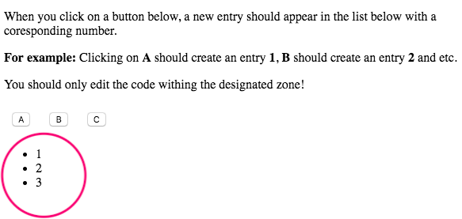

# JS\_Coding\_questions

## Q1. Make this work:

```javascript
duplicate([1, 2, 3, 4, 5]); // [1, 2, 3, 4, 5, 1, 2, 3, 4, 5]
```

### Sol:

```javascript
// Method 1:
function duplicate(arr) {
    return [...arr, ...arr]; // use spread
}

// Method 2:
function duplicate(arr) {
    return arr.concat(arr); // use concat
}
```

## Q2. Reverse array:

```javascript
function reverse(arr) {
    let new_arr = arr.map((x, i) => arr[arr.length-1-i]);
    return new_arr;
}
```

The `map()` method creates **a new array** with the results of calling a provided function on every element in the calling array.

## Q3. Remove duplicated value from an array:

```javascript
function dedupe (arr) {
    return arr.filter((x, i) => arr.indexOf(x) === i);
}

dedupe([1, 2, 1, 1, 3, 2]); // [1, 2, 3]
```

* The `filter()` method creates a new array with all elements that pass the test implemented by the provided function.
* The `indexOf()` method returns the first index at which a given element can be found in the array, or -1 if it is not present.

## Q4. Get the first unique char in string:

```javascript
function firstUnique (str) {
    let arr = str.split("");
    let freqs = [];
    arr.forEach(ch => {
        if (!freqs[ch]) {
            freqs[ch] = 1;
        } else {
            freqs[ch]++;
        }
    });

    for (let i = 0; i < arr.length; i++) {
        if (freqs[arr[i]] === 1) {
            return arr[i];
        }
    }
}

console.log(firstUnique("bbcffcge")); // g
```

The `forEach()` method executes a provided function once for each array element. \(mutate array in-place\)

## How to check if an object is an array type?

```javascript
Object.prototype.toString.call(arr);
// OR
Array.isArray(arr);
```

## Remove last item from array:

```javascript
arr.splice(-1, 1)
// OR
arr.length = arr.length - 1;
```

* `array.splice()`:
  * changes the contents of an array by removing existing elements and/or adding new elements
  * `array.splice(start[, deleteCount[, item1[, item2[, ...]]]])`
  * e.g.

    ```javascript
      var myFish = ['angel', 'clown', 'drum', 'mandarin', 'sturgeon'];
      var removed = myFish.splice(3, 1);

      // removed is ["mandarin"]
      // myFish is ["angel", "clown", "drum", "sturgeon"]

      var months = ['Jan', 'March', 'April', 'June'];
      months.splice(1, 0, 'Feb');
      // inserts at 1st index position
      console.log(months);
      // expected output: Array ['Jan', 'Feb', 'March', 'April', 'June']

      months.splice(4, 1, 'May');
      // replaces 1 element at 4th index
      console.log(months);
      // expected output: Array ['Jan', 'Feb', 'March', 'April', 'May']
    ```

  * A negative index can be used, indicating an offset from the end of the sequence. `slice(-2)` extracts the last two elements in the sequence.
* `array.slice()`:
  * returns a shallow copy of a portion of any array into a new array object selected from begin to end \(end not included\). The original array will not be modified.
  * `arr.slice([begin[,, end])`
  * ```javascript
    // Using slice, create newCar from myCar.
    var myHonda = { color: 'red', wheels: 4, engine: { cylinders: 4, size: 2.2 } };
    var myCar = [myHonda, 2, 'cherry condition', 'purchased 1997'];
    var newCar = myCar.slice(0, 2);

    // Display the values of myCar, newCar, and the color of myHonda
    //  referenced from both arrays.
    console.log('myCar = ' + JSON.stringify(myCar));
    console.log('newCar = ' + JSON.stringify(newCar));
    console.log('myCar[0].color = ' + myCar[0].color);
    console.log('newCar[0].color = ' + newCar[0].color);

    // Change the color of myHonda.
    myHonda.color = 'purple';
    console.log('The new color of my Honda is ' + myHonda.color);

    // Display the color of myHonda referenced from both arrays.
    console.log('myCar[0].color = ' + myCar[0].color);
    console.log('newCar[0].color = ' + newCar[0].color);
    ```
  * The above script writes:
  * ```javascript
    myCar = [{color: 'red', wheels: 4, engine: {cylinders: 4, size: 2.2}}, 2,
           'cherry condition', 'purchased 1997']
    newCar = [{color: 'red', wheels: 4, engine: {cylinders: 4, size: 2.2}}, 2]
    myCar[0].color = red 
    newCar[0].color = red
    The new color of my Honda is purple
    myCar[0].color = purple
    newCar[0].color = purple
    ```

## Remove a property from object:

```javascript
let obj = {
    "ircEvent": "PRIVMSG",
    "method": "newURI",
    "regex": "^http://.*"
}

delete obj.regex;
// OR
delete obj['regex'];
```

## `Array.splice()` vs. `Array.slice()`:

* The `splice()` method returns the removed items in an array and `slice()` method returns the selected elements in an array, as a new array object
* The `splice()` method changes the original array and `slice()` method doesn't change the original array
* The `splice()` method can take n number of arguments

## [Implementation of Native JavaScript Methods \(forEach, Map, Filter, Reduce, Every, Some\)](https://gist.github.com/alexhawkins/28aaf610a3e76d8b8264)

```javascript
Array.prototype.myFilter = function(callback) {
    let res = [];
    for (let ele of this) {
        if (callback(ele)) {
            res.push(ele);
        }
    }
    return res;
}

console.log([1, 2, 3, 6, 1].myFilter((ele) => {
    return ele > 3;
}));
```

## Regex: 

[https://regexr.com/](https://regexr.com/)

## SetTimeout:

```javascript
// interviewer: what will the following code output?
for (var i = 0; i < 4; i++) {
  setTimeout(function() {
    console.log(i);
  }, 500);
}
// Output:
// 4
// 4
// 4
// 4
```

```javascript
// Ans: way1 (recommended)
for (var i = 0; i < 4; i++) {
  (function (i) {
    setTimeout(() => console.log(i), 500)
  })(i)
}

// way2
for (var i = 0; i < 4; i++) {
  setTimeout(function(i_local) {
    return function() { console.log(i_local); }
  }(i), 500);
}

// Output:
// 0
// 1
// 2
// 3
```

## `Array.prototype.slice.call()`

{% embed data="{\"url\":\"https://stackoverflow.com/questions/7056925/how-does-array-prototype-slice-call-work\",\"type\":\"link\",\"title\":\"how does Array.prototype.slice.call\(\) work?\",\"description\":\"I know it is used to make arguments a real array, but I don\'t understand what happens when using Array.prototype.slice.call\(arguments\)\",\"icon\":{\"type\":\"icon\",\"url\":\"https://cdn.sstatic.net/Sites/stackoverflow/img/apple-touch-icon.png?v=c78bd457575a\",\"aspectRatio\":0},\"thumbnail\":{\"type\":\"thumbnail\",\"url\":\"https://cdn.sstatic.net/Sites/stackoverflow/img/apple-touch-icon@2.png?v=73d79a89bded\",\"width\":316,\"height\":316,\"aspectRatio\":1}}" %}

* This method treats array-like stuff \(especially object\) like an array, so that array functions can be applied, e.g.`.slice`, because `.slice` only works for array type.

{% embed data="{\"url\":\"https://github.com/paddingme/Front-end-Web-Development-Interview-Question/blob/master/interview/1.md\",\"type\":\"link\",\"title\":\"paddingme/Front-end-Web-Development-Interview-Question\",\"description\":\"前端开发面试题大收集，前端面试集锦 :heart: :gift\_heart: :cupid:. Contribute to paddingme/Front-end-Web-Development-Interview-Question development by creating an account on GitHub.\",\"icon\":{\"type\":\"icon\",\"url\":\"https://github.com/fluidicon.png\",\"aspectRatio\":0},\"thumbnail\":{\"type\":\"thumbnail\",\"url\":\"https://avatars1.githubusercontent.com/u/5771087?s=400&v=4\",\"width\":180,\"height\":180,\"aspectRatio\":1}}" %}

## JS Callbacks:

When you click on a button below, a new entry should appear in the list below with a corresponding number.

E.g. Clicking on A should create an entry 1, B should create an entry 2 and etc. You should only edit the code within the designated zone!

Given:

```css
button {
    margin: 10px;
    cursor: pointer;
}
```

```markup
<p>When you click on a button below, a new entry should appear in the list below with a coresponding number.</p>

<p><b>For example:</b> Clicking on <b>A</b> should create an entry <b>1</b>, <b>B</b> should create an entry <b>2</b> and etc.</p>

<p>You should only edit the code withing the designated zone!</p>

<button>A</button>
<button>B</button>
<button>C</button>

<ul></ul>
```

To do: in Jquery

```javascript
$(document).ready( function() {
  var buttons = $('button');

  for( var i = 0; i < buttons.length; ++i ) {
    buttons.eq(i).click(
    	// ONLY EDIT THE CODE BELOW THIS LINE
    	(
        	function(i) {
            i++;
            return function() {
            	$('ul').append('<li>' + i + '</li>')
            }
          }
        )(i)
      
    	// ONLY EDIT THE CODE ABOVE THIS LINE
    );
  }
});
// Used IFFE
```

Output:




